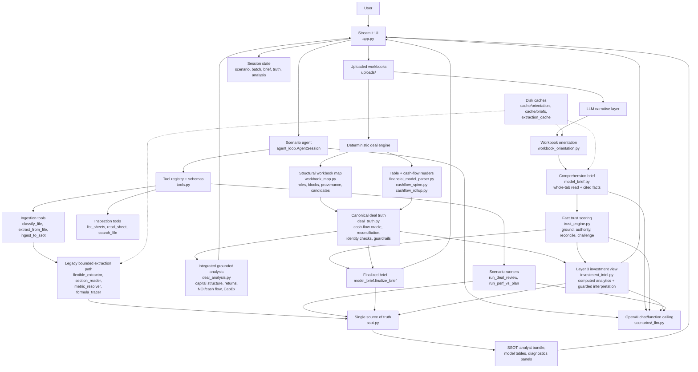
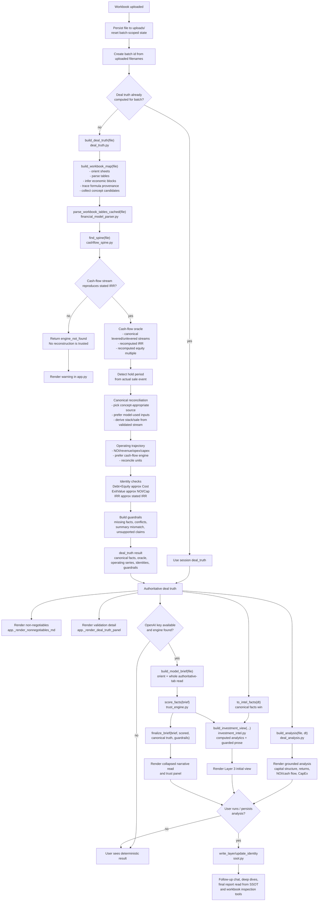

# Collie v2 Current Architecture Diagrams

These diagrams reflect the current code layout after reviewing the main runtime
paths in `app.py`, `agent_loop.py`, `tools.py`, `workbook_map.py`,
`deal_truth.py`, `deal_analysis.py`, `model_brief.py`, `trust_engine.py`,
`investment_intel.py`, and `ssot.py`.

## Current Architecture

### Architecture Notes

- `app.py` is the product shell: scenario selection, upload persistence,
  session-level caching, rendering, and orchestration.
- `agent_loop.py` provides scenario-scoped chat with a constrained tool subset.
  The agent can ingest files, inspect sheets, run scenario summaries, and answer
  follow-ups.
- The current deal-review happy path leads with the deterministic engine:
  `deal_truth.py` reconstructs canonical facts from workbook structure and
  validated cash-flow streams, then `deal_analysis.py` renders the grounded
  analysis.
- The LLM narrative layer still exists, but it is secondary in the UI: it reads
  authoritative tabs, scores cited facts, finalizes only trusted assertions, and
  feeds Layer 3 investment interpretation.
- `ssot.py` is the durable internal record for verified facts, brief text,
  initial view analytics, reports, layers, and identity.
- The legacy bounded metric extraction path is retained for no-key fallback,
  diagnostics, and performance-vs-plan workflows.

## Engine Flow

### Engine Invariants

- The deterministic engine does not use GPT for extraction. Its trust anchor is
  the workbook's own cash-flow stream matching the model's stated IRR.
- If no validated cash-flow spine is found, the engine refuses to reconstruct
  the deal instead of filling gaps from weak summary labels.
- Canonical returns are recomputed from validated streams, not copied from
  possibly stale or mislabeled summary cells.
- Formula provenance separates a displayed number from the source cell the model
  actually uses.
- Guardrails are generated from detected evidence in the workbook and are passed
  into later narrative layers so GPT cannot assert unsupported conclusions.
- The LLM brief/trust path is additive: it improves narrative and interpretation,
  while deal truth remains the authoritative fact spine when present.
